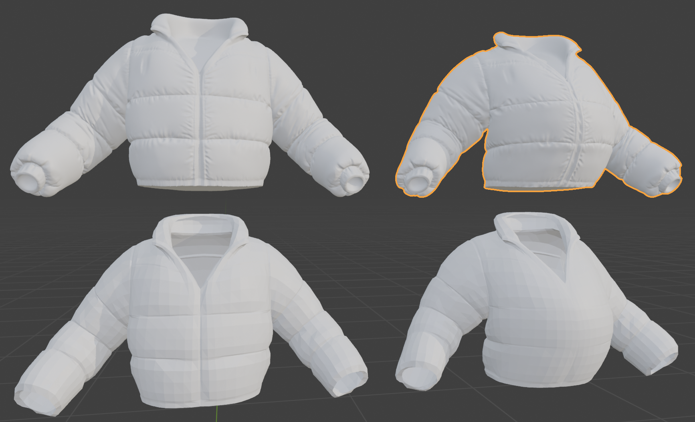

# Biharmonic Deformation Transfer (Blender Add-on)

Transfers deformations from a (low-resolution) mesh to another (high-resolution) mesh.

Example use case: you sculpted a high-resolution mesh A, and then created a lower-resolution
mesh B with a clean topology (say, for for deployment in a video game with textures baked from A).
After inspection, you make some updates to the low-res mesh, resulting in a deformed low-mesh C.
You now want to _transfer_ the deformation B → C to the high-res mesh A.

<figure>
  
  <figcaption>Bottom: original and deformed low-res mesh.
              Top: original high-res mesh and transfered deformation created by addon (orange)
  </figcaption>
</figure>

Under the hood, the addon uses _biharmonic deformations_, implemented
using the `libigl` library. This means tha the high-res mesh is
treated like an elastic sheet that resists bending and stretching.
The vertices of the low-res mesh are used as _handles_ at which a
deformation is imposed on the high-res mesh.

## Install
1. Download the extension from the `dist` folder.
2. In Blender, open **Edit → Preferences → Extensions**.
3. Click **Install from Disk…** and select the platform-specific zip:
   - macOS (Intel): `biharmonic_deformation_transfer-0.1.0-macos_x64.zip`
   - macOS (Apple Silicon): `biharmonic_deformation_transfer-0.1.0-macos_arm64.zip`
   - Windows: `biharmonic_deformation_transfer-0.1.0-windows_x64.zip`
4. Enable the add-on.

## Use
1. Go to **Scene Properties → Biharmonic Deformation Transfer**.
2. Select three mesh objects:
   - Original: low-res mesh
   - Deformed: deformed mesh (must have same topology as original)
   - Transfer-to: high-res mesh (must be spatially aligned with original)
3. Click **Transfer Deformation**.

A new mesh named `<HighResName>_deformed` will be created in the scene.
